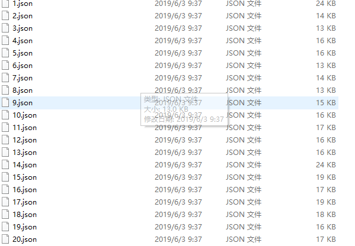
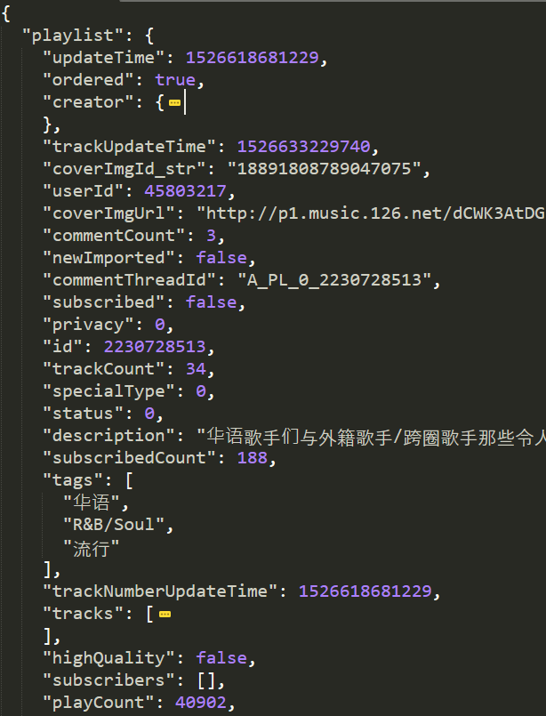
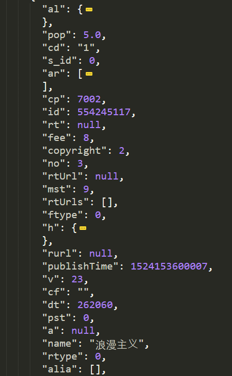
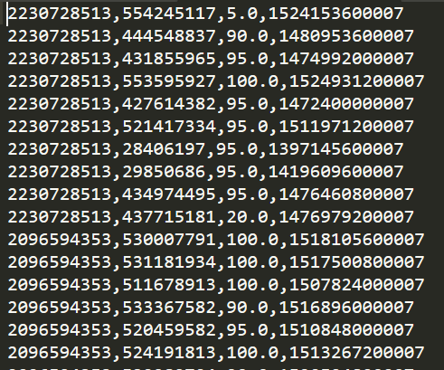
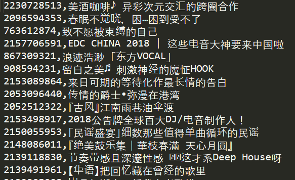
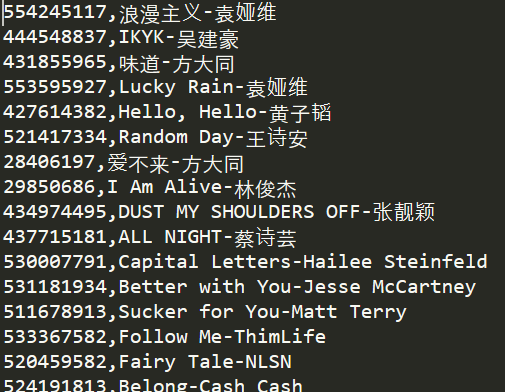
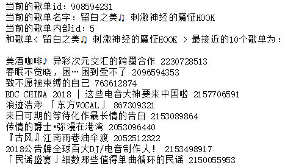
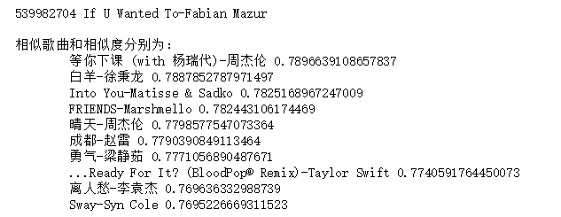
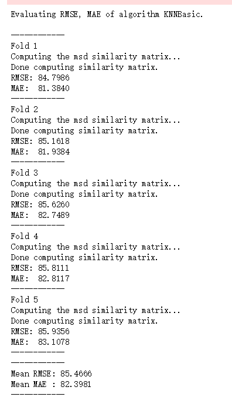

# 2016级项目实训成果展示 

## 《音乐推荐系统》 - Python与机器学习方向

### 项目简介

一个音乐推荐算法，通过用户最近听的歌单或者歌曲，相应进行相似歌单歌曲推荐。

#### 项目成员

- 吴智栋
- 冉文端
- 胡海锋
- 刘倩倩

### 数据集简介

数据集为1291个json文件,每个 json 文件对应一个歌单，每个歌单下面包括10首单曲

### 项目截图

#### 数据集

#### 歌单信息

#### 单曲信息

#### 数据处理

#### 结果及误差

