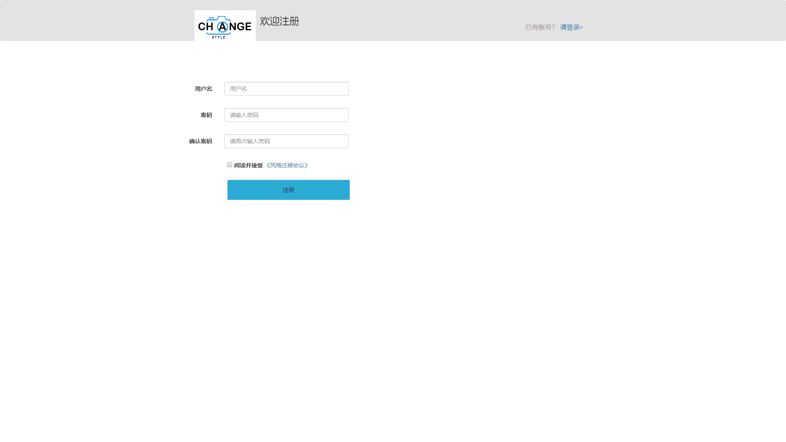
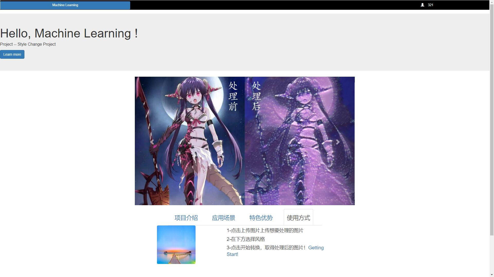
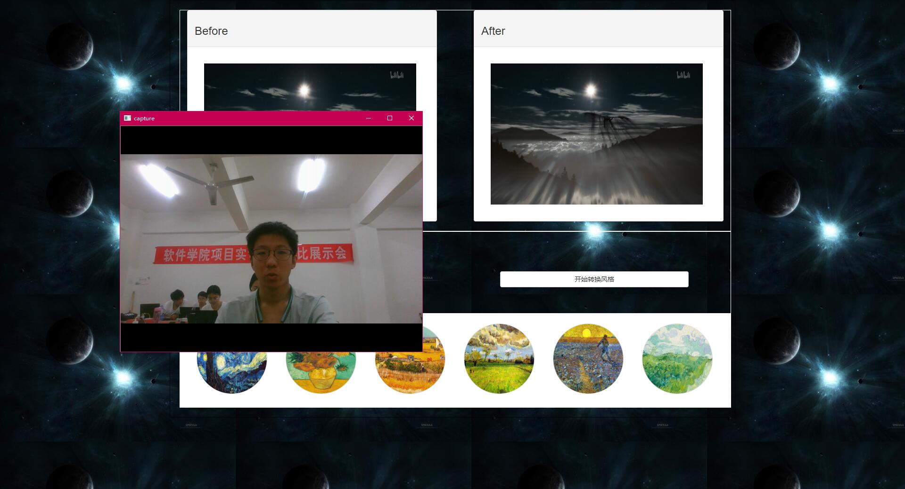

# 2016级项目实训成果展示 

## 《风格迁移》 - Python与机器学习方向

### 项目简介

一款“图片转换风格的web应用”——拥有特别的图片！

### 项目地址

### 项目成员

- 谢江帆（项目经理、UI设计师、开发工程师、测试工程师）

  - Email：782236966@qq.com

  - Github：https://github.com/xiejiangfan-2016

- 范浩宇（技术总监、开发工程师、测试工程师）

  * Email：17363020943@163.com 

  * Github：https://github.com/haoyufan1997

- 王宇开（产品经理、UI设计师、开发工程师、测试工程师）

  - Email：wyklovegoddess@hotmail.com

  - Github：https://github.com/MarshallOpen

### 项目截图

