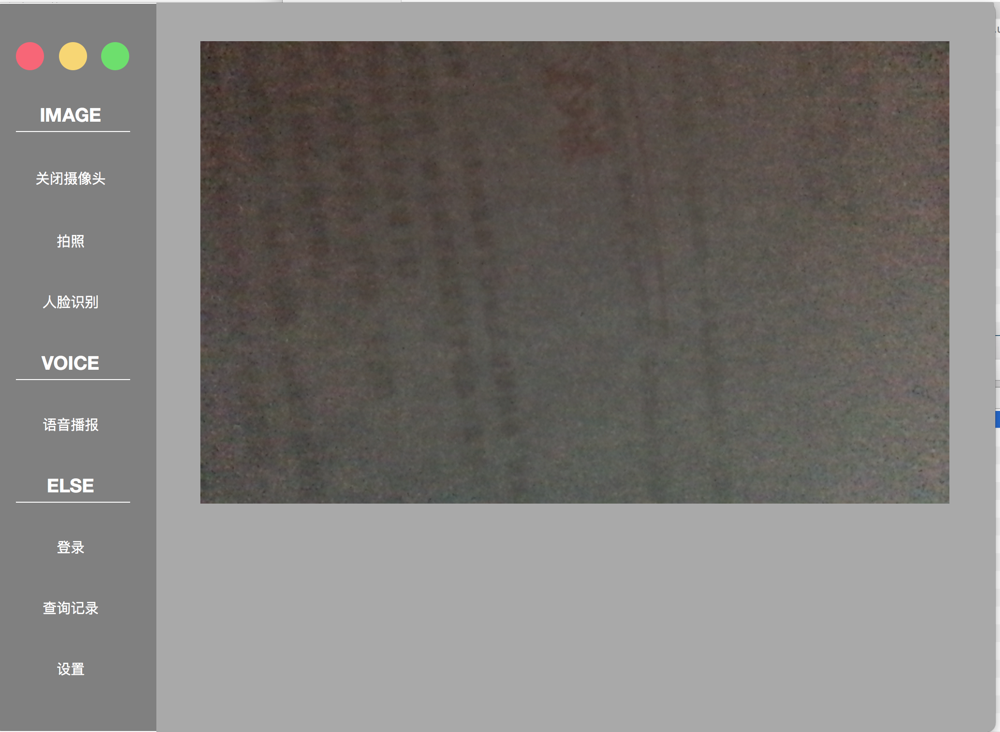
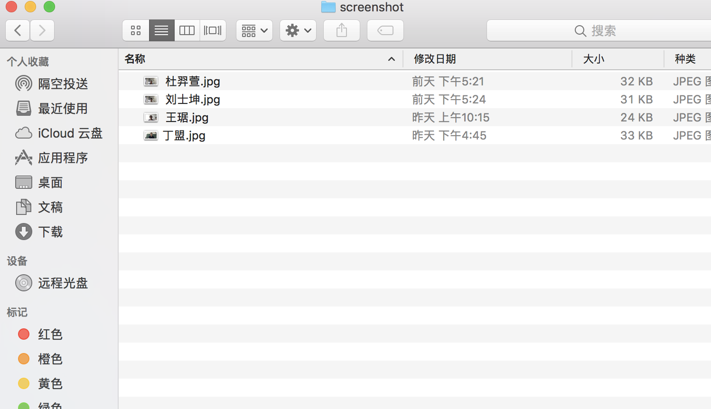
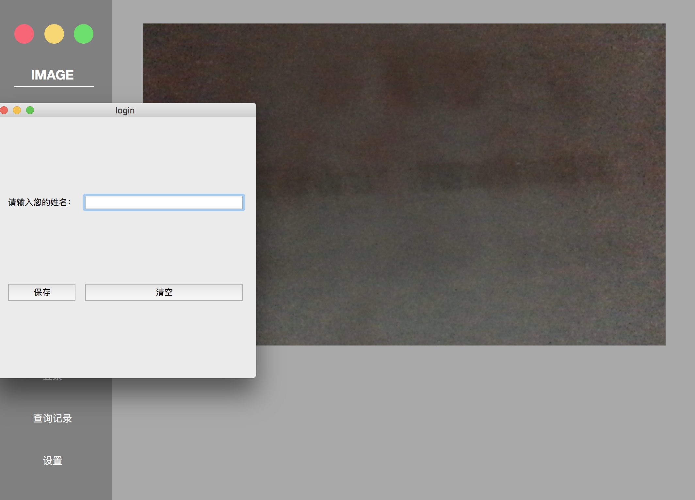

# 2016级项目实训成果展示 

## 《高校课堂实时签到系统》 - Python与机器学习方向

### 项目简介

**高校课堂实时签到系统**是一个使用机器学习算法进行人脸识别，帮助高校师生快速完成学生出勤情况、学生课堂状态、离开教室情况等课堂信息统计的应用程序。

### 项目成员

- 杜羿萱（算法工程师，项目经理）
	- GitHub: [https://github.com/yixuanxuanxuan](https://github.com/yixuanxuanxuan)
- 王琚（算法工程师）
	- GitHub: [https://github.com/123wangju123](https://github.com/123wangju123)
- 王晓意（UI设计师）
	- GitHub: [https://github.com/greatoldons](https://github.com/greatoldons)
- 熊毅（产品经理，测试）
	- GitHub: [https://github.com/0nechance1](https://github.com/0nechance1)
- 徐安（产品经理，测试）
	- GitHub: [https://github.com/xuan97916](https://github.com/0nechance1)

### 产品特性

- 采用基于卷积神经网络的人脸识别算法，稳定快捷，通过生物特征识别杜绝学生代签，增加成绩公平性
- 人脸识别算法准确度高，经验证，亚洲人脸识别准确率约为97.35%，欧洲人脸识别率约为99.23%
- 支持上课名单预导入与签到结果导出，方便教师统计出勤情况
- 对于临时上课的同学，可以使用及时拍照功能进行人脸录入，方便管理
- 提供Windows, MacOS, Android, IOS跨平台支持，使用更加便捷高效

### 产品框架

- - 人脸识别：基于卷积神经网络的目标检测
- UI交互界面：PyQt5

### 项目截图

#### 开启摄像头功能

#### 拍照作为数据库存储到本地

#### 拍照输入登录名字界面

#### 查询刚刚识别过的记录

 

#### 识别记录自动存储到本地

