# 2016级项目实训成果展示 

## 《Snowcrash测试组》 - 软件测试方向

###  项目简介

关于一款话题资讯的App的测试——内容丰富的首页，是否有漏洞在潜伏，私人订制的页面，减少不必要的信息检索是否存在缺陷，通过测试发现问题，立即解决雪崩一款包含二次元信息推送，游戏玩家生活分享功能的APP。

雪崩是一款休闲娱乐向的APP。旨在搭建起广大二次元爱好者和游戏爱好者交流沟通的桥梁。打造集动漫，游戏，生活分享，商品交易等信息共享平台，为时下的青少年提供更加订制化的休闲娱乐体验，保证用户减少信息收集时间成本的同时，实现自身的盈利。 

### 项目成员      

- 岳哲伟(项目经理，测试工程师)
	- Email:1084170857@qq.com
	- Github:https://github.com/yuezhewei

- 刘江(测试工程师)
	- Email:2562707156@qq.com
	- Github:https://github.com/jiang1314
	
- 甄攀星(测试开发工程师)
	- Email:913884616@qq.com
	- Github:https://github.com/zhenpanxing
	
- 王娟（测试开发工程师）
	- Email:2402370100@qq.com
	- Github:https://github.com/wangjuan
	
- 李欣然(测试开发工程师)
	- Email:952184149@qq.com
	- Github:https://github.com/lixinran
  
- 张玉(测试开发工程师)
	- Email:1336448191@qq.com
	- Github:https://github.com/zhangyu
	
### 运行效果

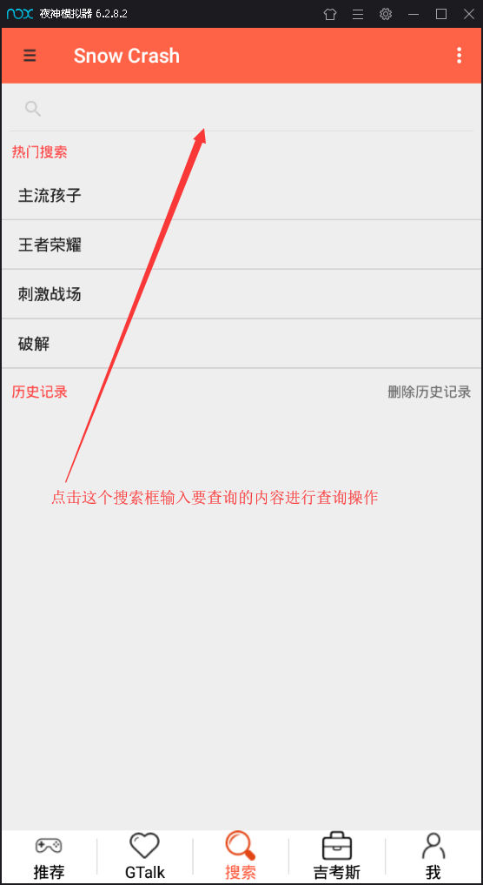
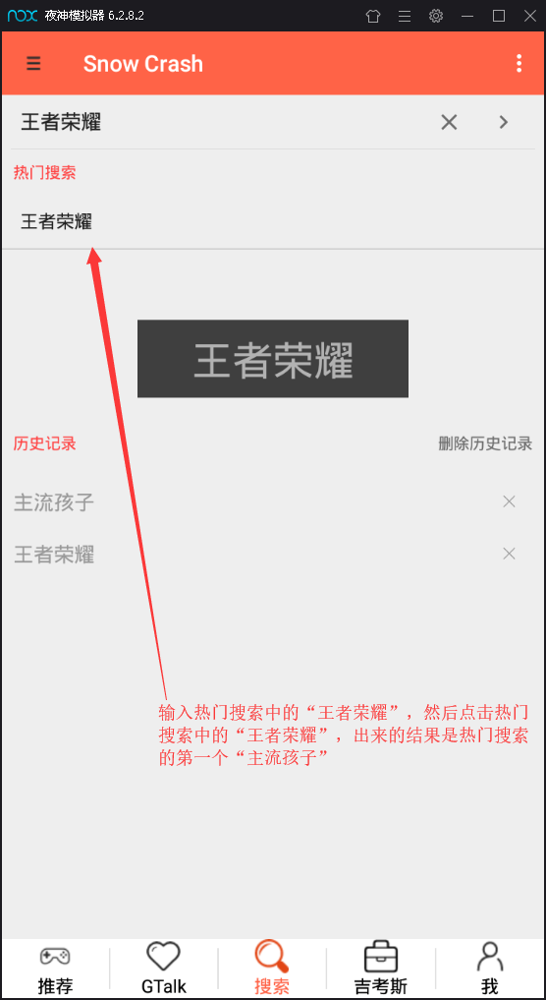
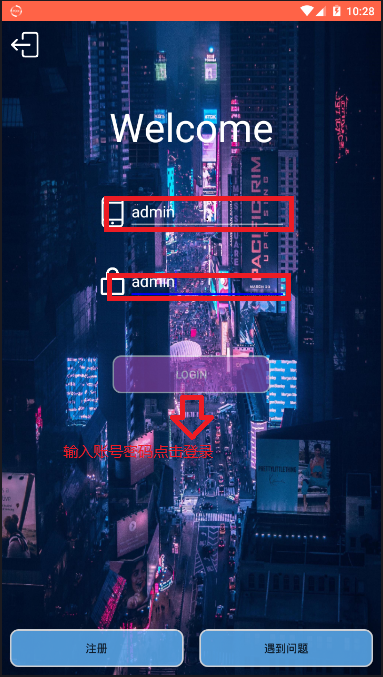

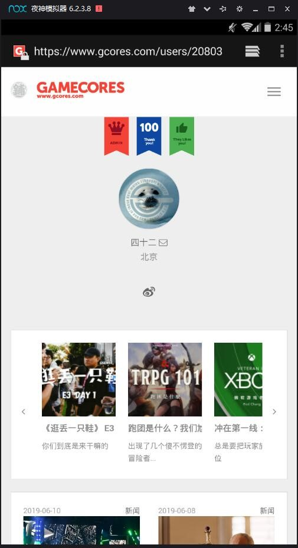

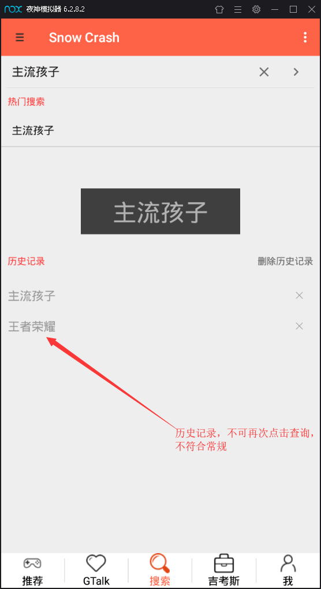

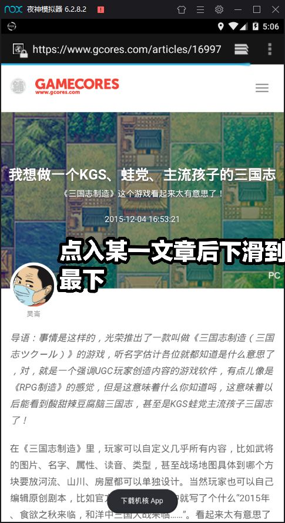
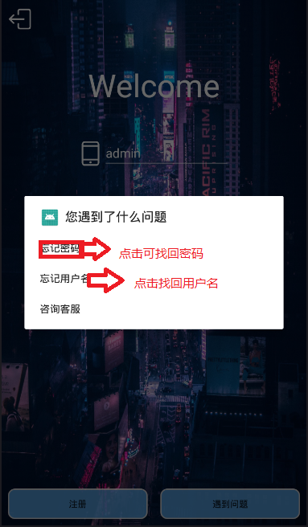

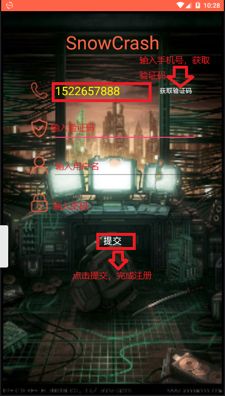

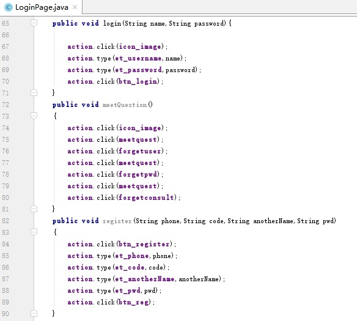

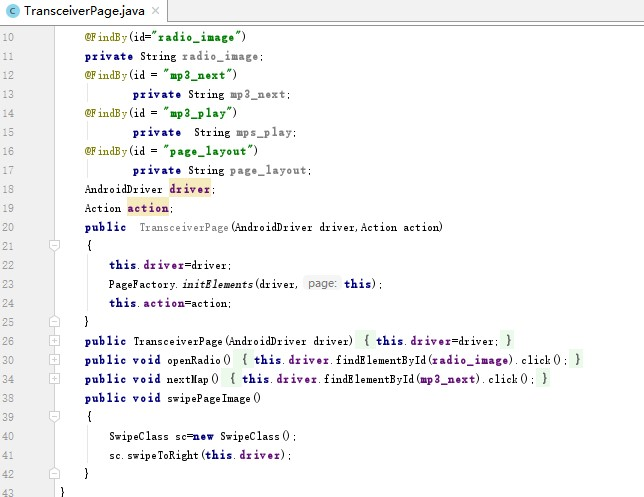
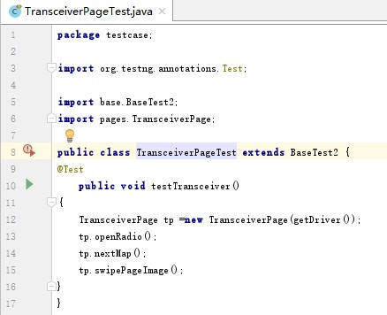

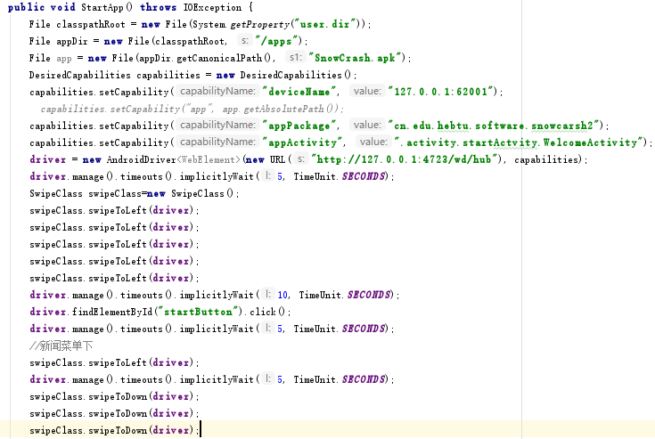

