# 2016级项目实训成果展示 

## 《apptest测试组》 - 软件测试方向

###  项目简介

“游迹”是一款旅行记录和分享App，用户可以通过android设备便捷建立自己的旅行游记，图文并茂，App会记录时间和地理位置信息，可以和好友分享你的方位、游览景色、旅游心情等等。可以随时通过android设备，查找旅游目的地，查看其它用户的行程攻略作为参考，给自己的旅行提前做好准备和参考，沟通热爱旅游的小伙伴。

### 项目地址

- Github：[https://github.com/liuchen0510/apptest](https://github.com/liuchen0510/apptest)

### 项目成员

- 刘宸（项目组长、测试工程师）
  - Email：[825147384@qq.com](mailto:825147384@qq.com) 
  - Github：

- 刘海新（测试工程师）
  - Email：[3430198340@qq.com](mailto:3430198340@qq.com)
  - Github：

- 杨凯静（测试工程师）
  - Email：[2939479023@qq.com](mailto:2939479023@qq.com)
  - Github：

- 王浩馨（测试工程师）
  - Email：[664852088@qq.com](mailto:664852088@qq.com)
  - Github：

- 秦一诺（测试工程师）
  - Email：[562938990@qq.com](mailto:562938990@qq.com)
  - Github：

- 于俊伟（测试工程师）
  - Email：[1364356401@163.com](mailto:1364356401@163.com)
  - Github：

- 陈若繁（测试工程师）
  - Email：[1297985138@163.com](mailto:1297985138@163.com)
  - Github：

### 项目截图

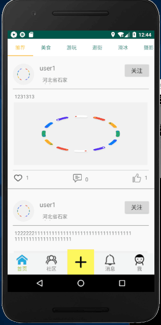
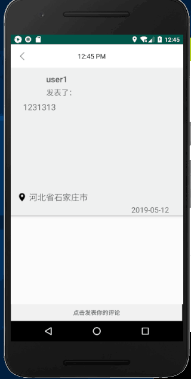
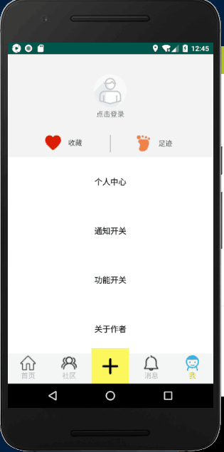

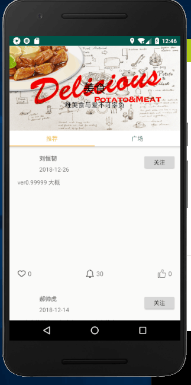

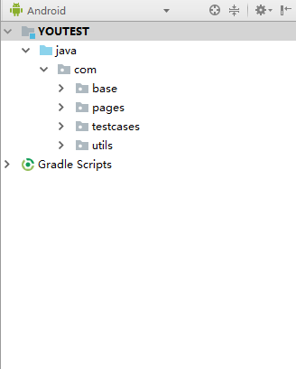
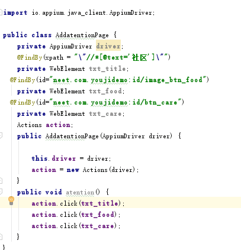
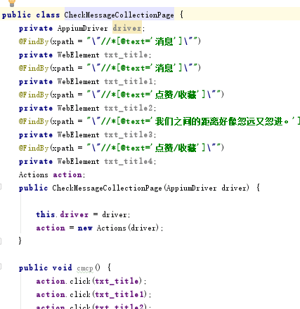

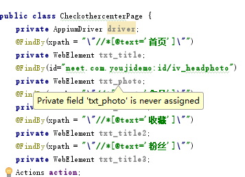
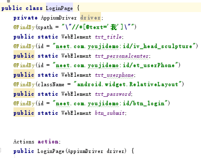
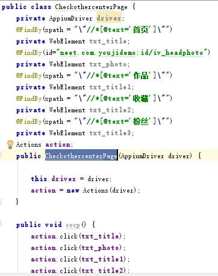

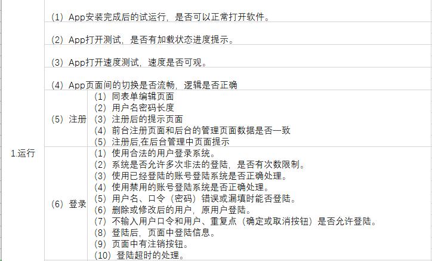
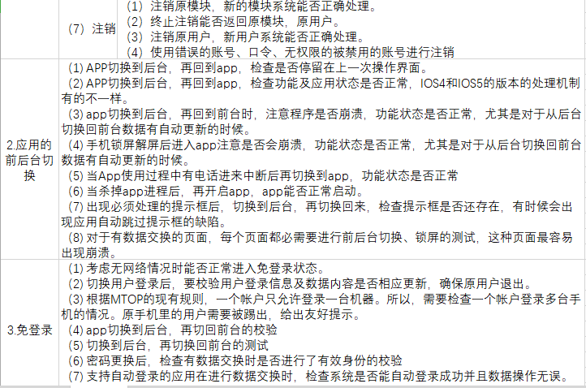
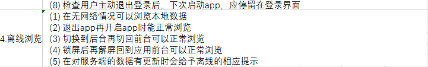

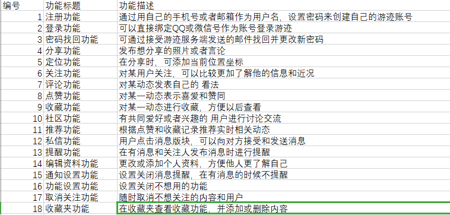
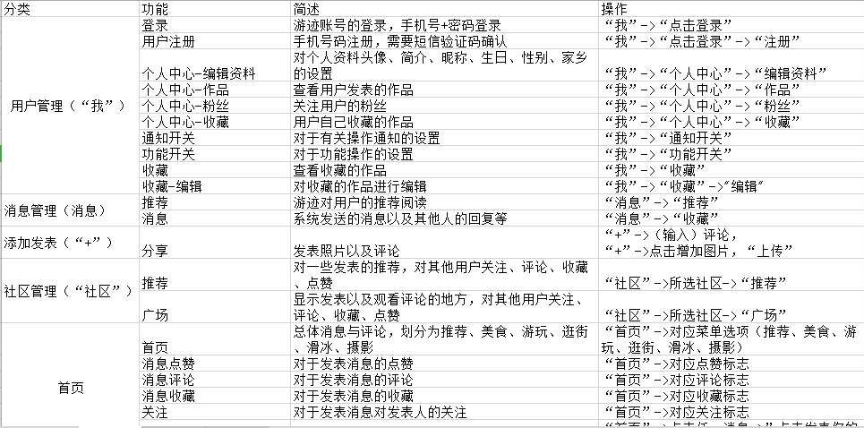

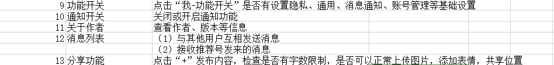
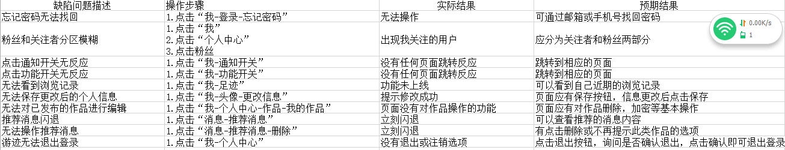
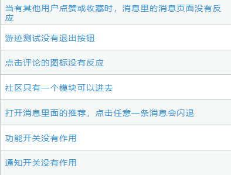

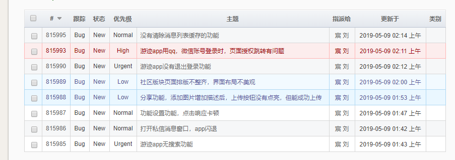
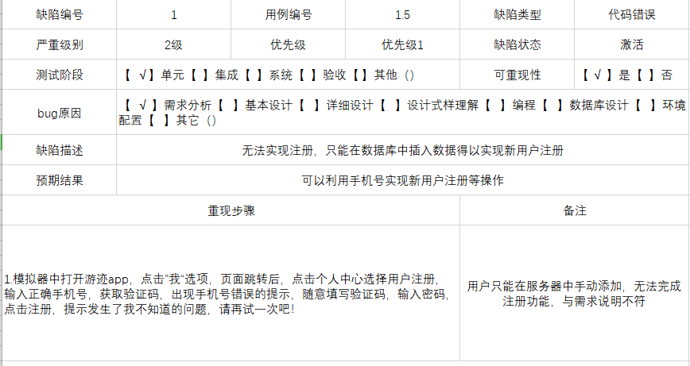

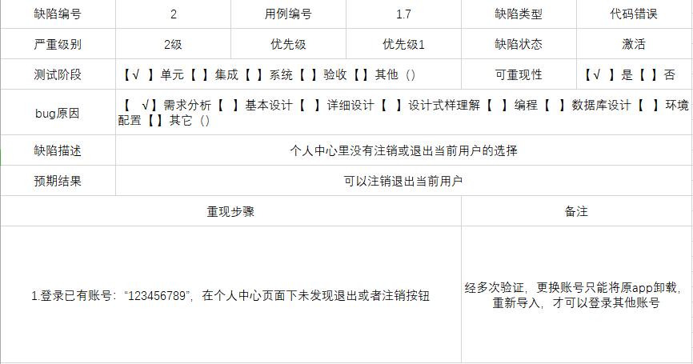
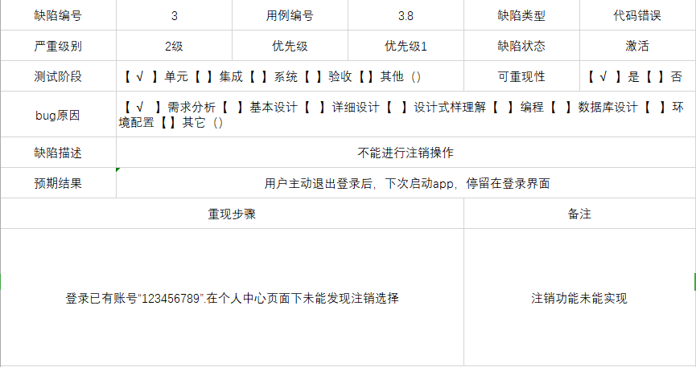

