# 2016级项目实训成果展示 

## 《bug-killer测试组》 - 软件测试方向

### 测试简介

- Solar

一款高效习惯养成的APP，实用性时间管理工具。

针对此项目客户端采用基于Java+Appium+TestNG的移动端测试。

针对服务器端采用基于LoadRunner的性能测试。

- Linear

一款运行在 Android 端的运动类APP。

针对此项目客户端采用基于Java+Appium+TestNG的移动端测试。

- bugfree

一款网页版管理bug和测试用例的工具。

分别基于LoadRunner和JMeter进行性能测试。

### 项目成员

- 段晓月（测试工程师）
  - Email：74110751@qq.com
  - Github：https://github.com/duanxiaoyue
- 王东慧（测试工程师）
  - Email：1941294473@qq.com
  - Github：https://github.com/wangdonghui1998
- 齐放（测试工程师）
  - Email：739242114@qq.com.
  - Github：https://github.com/RttN
- 王鑫钰（测试工程师）
  - Email：982339661@qq.com
  - Github：https://github.com/wangyunshen2001
- 程子健（测试工程师）
  - Email：709411753@qq.com
  - Github：https://github.com/ToCz

### 移动端测试

#### 功能列表和缺陷报告

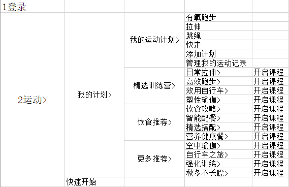
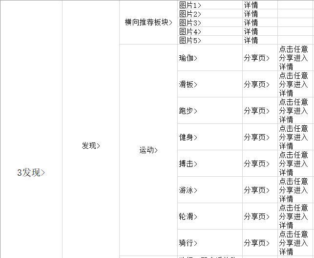

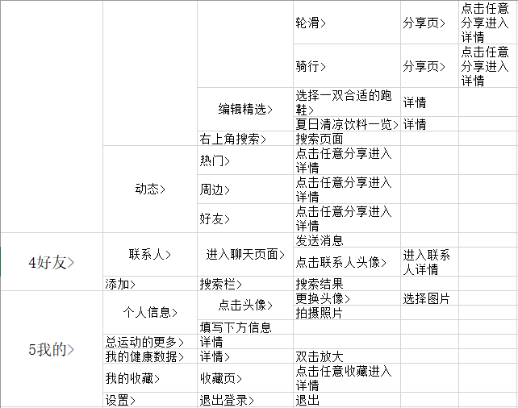
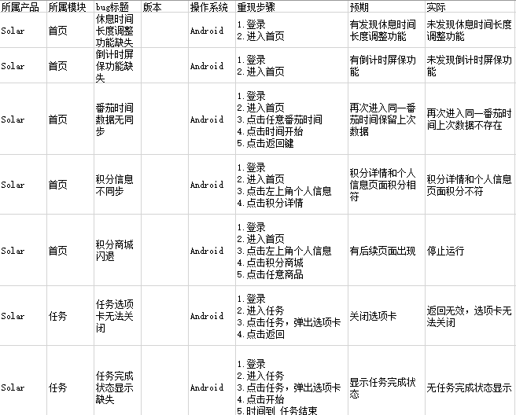
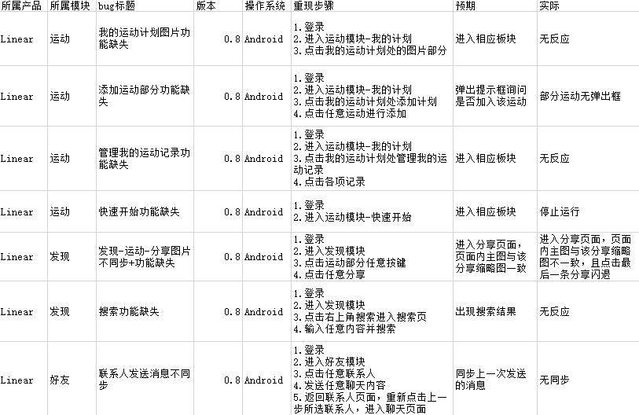

#### 测试用例

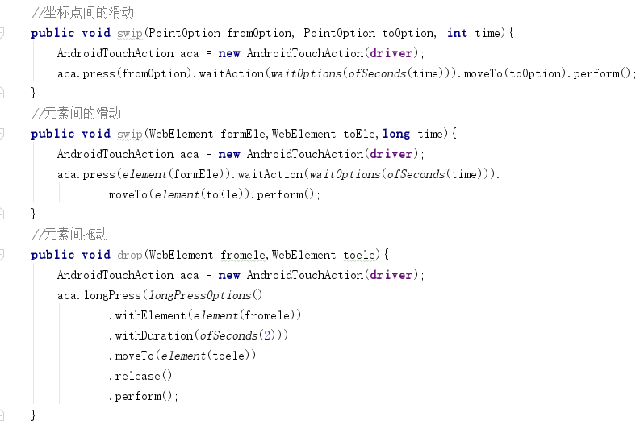
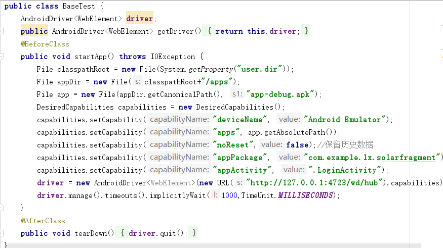

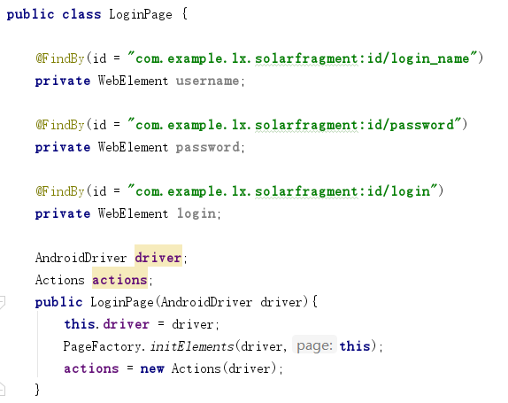
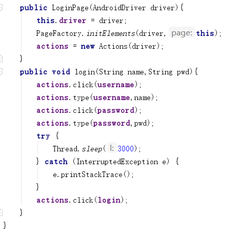
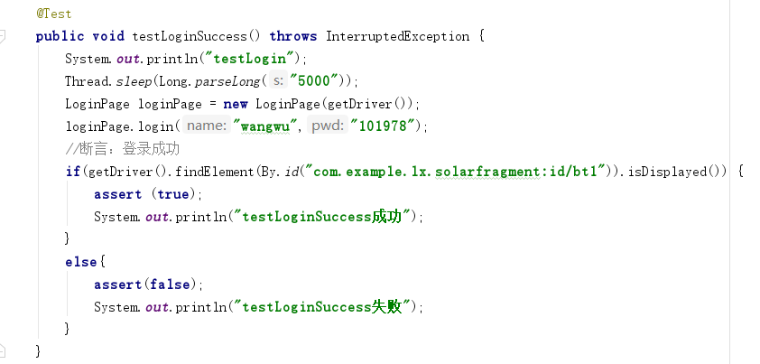

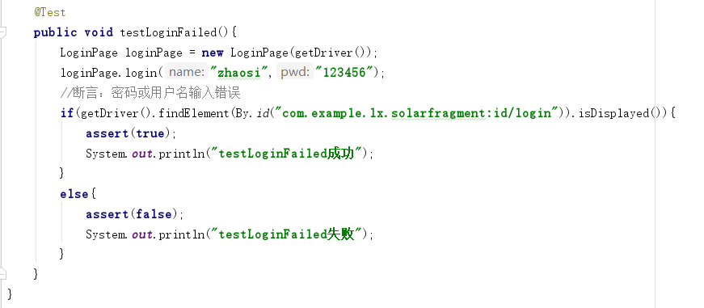
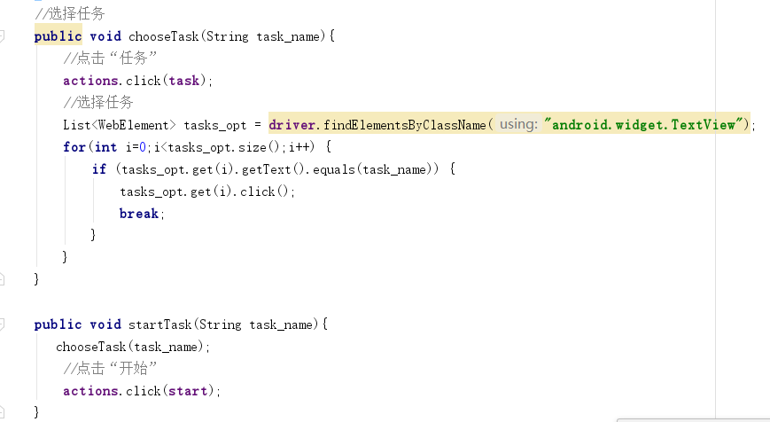
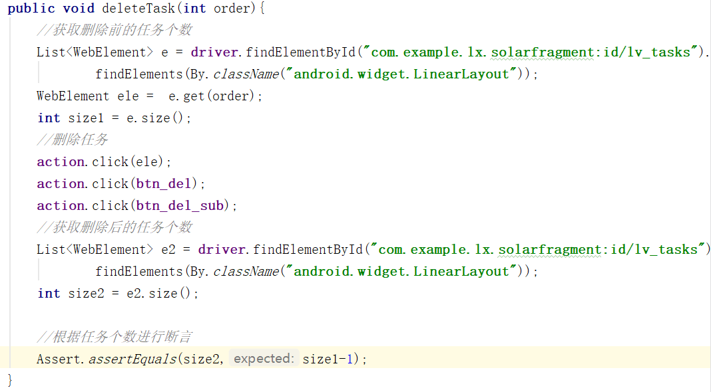

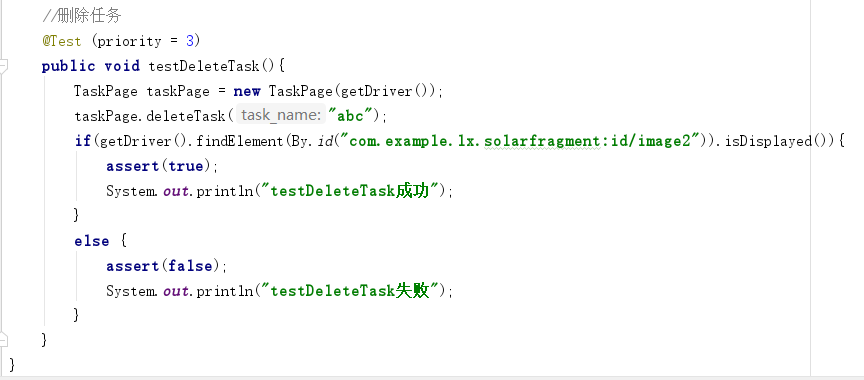

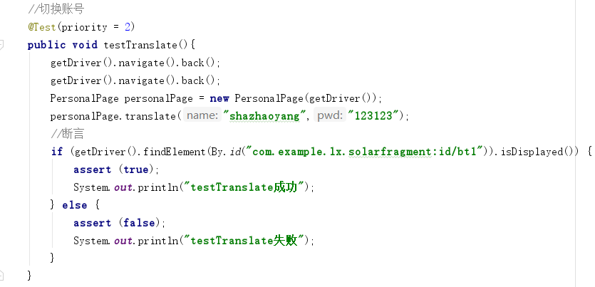

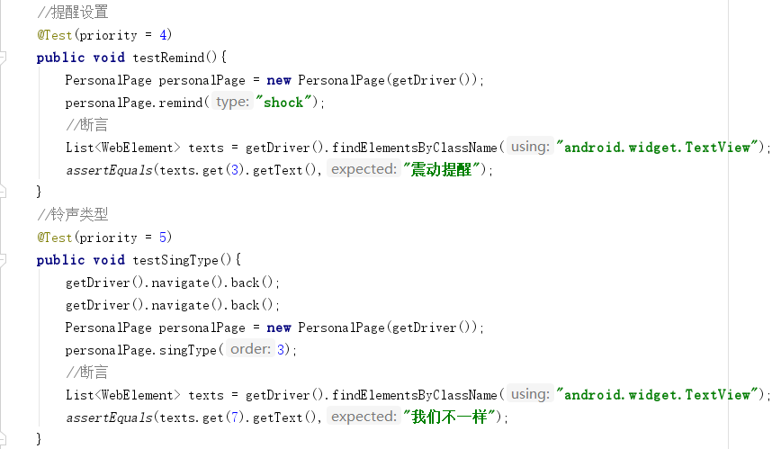
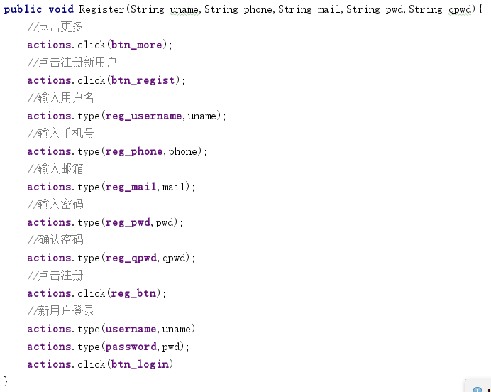

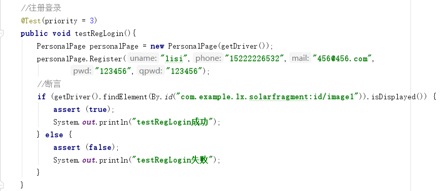
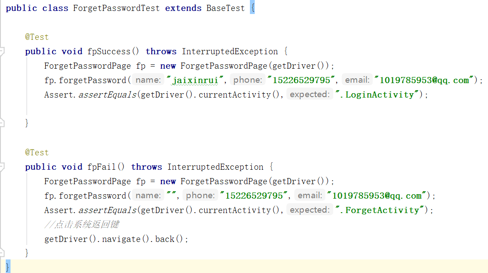
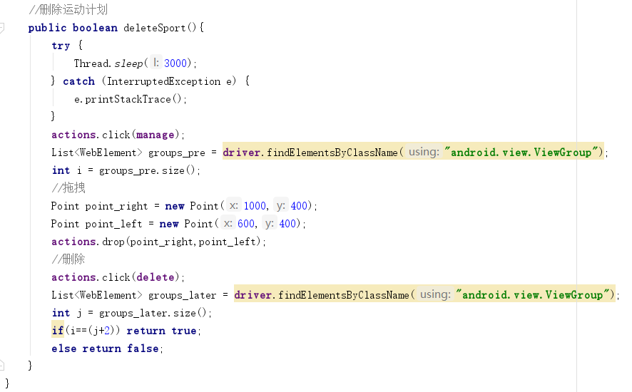

#### 测试报告

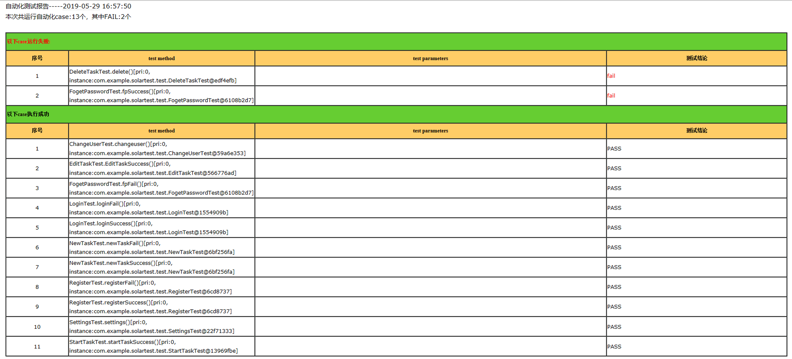

### 性能测试

#### LoadRunner

对bugfree的两个关键业务进行负载测试，在虚拟用户量不断增加的情况下查看CPU，内存等的使用状态，找到服务器的用户上限。

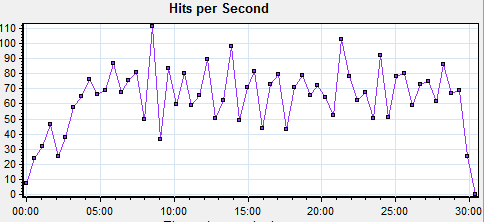
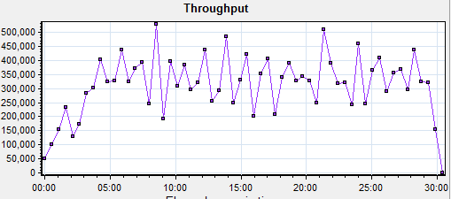

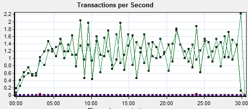
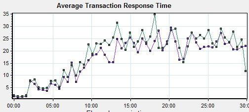

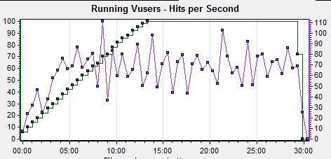
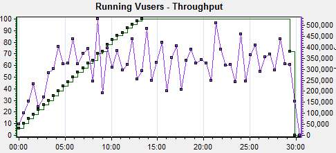

#### JMeter

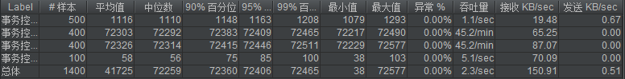

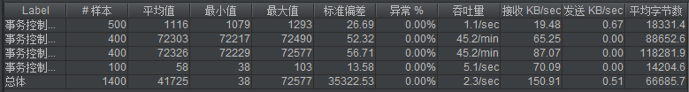

