# 2016级项目实训成果展示 

## 《轻游测试组》 - 软件测试方向

###  项目简介

轻游是一款“旅游攻略型App”——衣食住行，样样行！

人的一生，在工作学习生活中会面临各式各样的烦恼，忧虑，纠结还有各种各样的问题。越是这种时候，我们更要放松自己，给自已一段无忧无虑的时光，让自己彻底远离纷扰与喧嚣。更可以寻找到志同道合的朋友，多方面满足自己、提升自己。

针对于app的四大模块及附属子模块进行功能和性能测试。

### 项目地址

- Github：[https://github.com/DiaoZHAZHA/QingYou-2016appTest](https://github.com/DiaoZHAZHA/QingYou-2016appTest)

### 项目成员

- 韦士杰（项目经理、UI设计师、测试工程师）
	- Email：827848183@qq.com 
	- Github：

- 王鹏赫（市场总监、UI设计师、测试工程师）
	- Email：2240024073 @qq.com  - 
	- Github：

- 王得润（技术总监、UI设计师、测试工程师）
	- Email：727075670@qq.com
	- Github：

- 韦宇杰（技术总监、UI设计师、测试工程师）
	- Email：11335395@qq.com
	- Github：

- 马瑞华（产品经理、UI设计师、测试工程师）
	- Email：763409173@qq.com
	- Github：

- 刘振扬（产品经理、UI设计师、测试工程师）
	- Email：3466589527@qq.com
	- Github：

- 刁立翔（质量专家、UI设计师、测试工程师）
	- Email：419060143@qq.com
	- Github：

### 项目截图

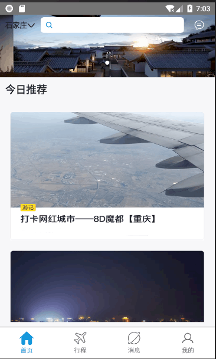
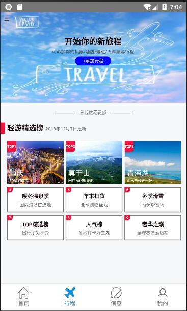

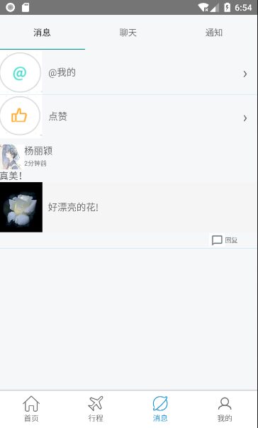

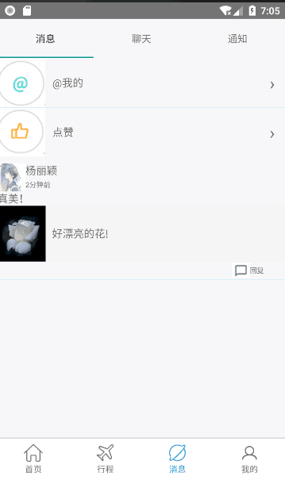

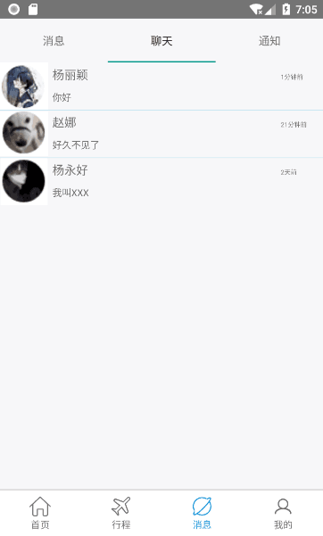
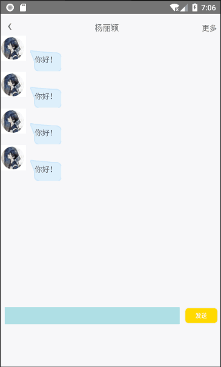

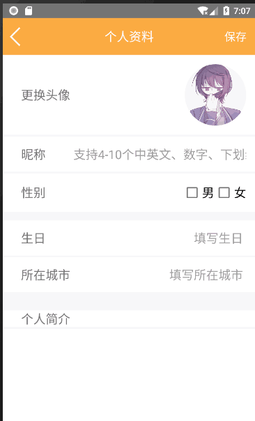
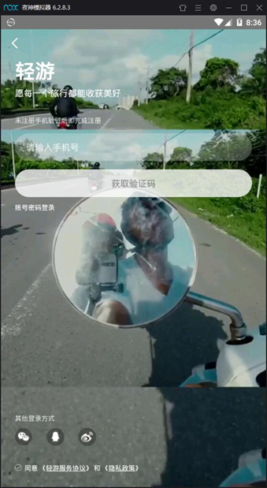

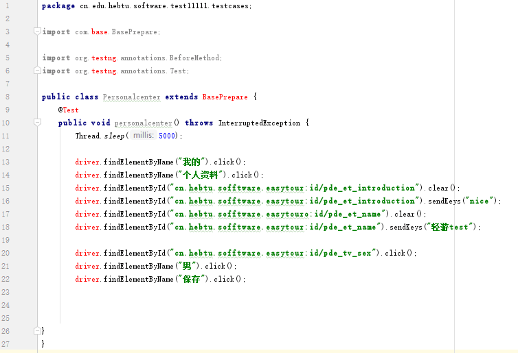

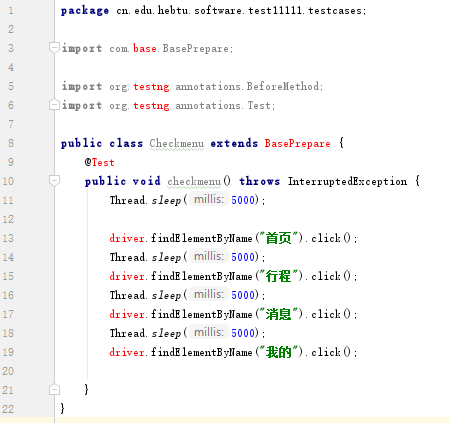
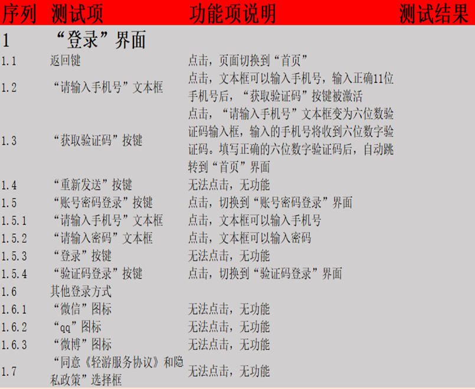

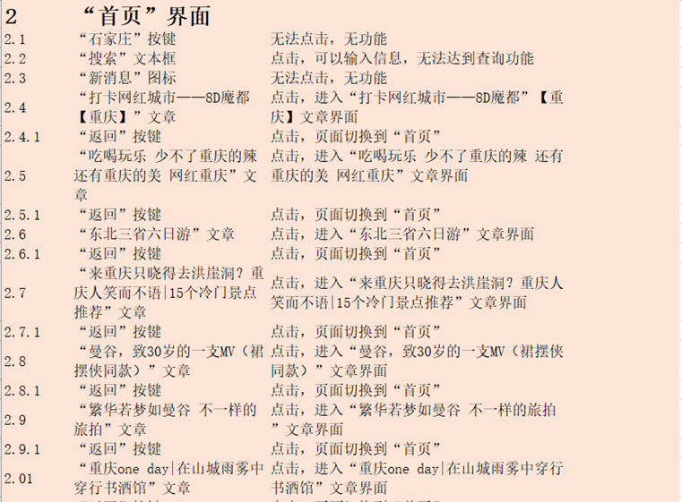
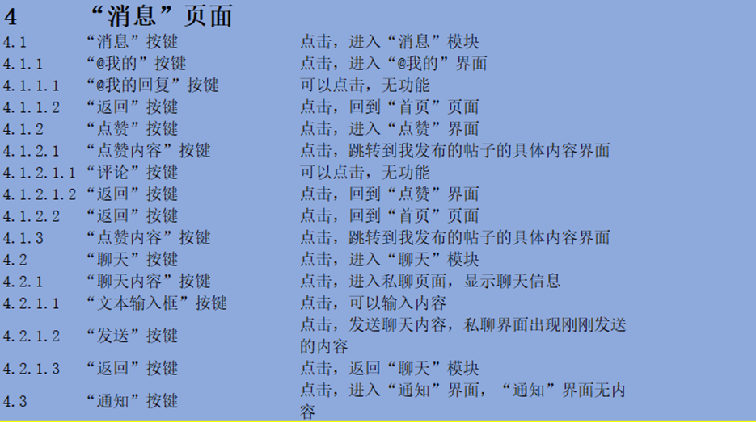

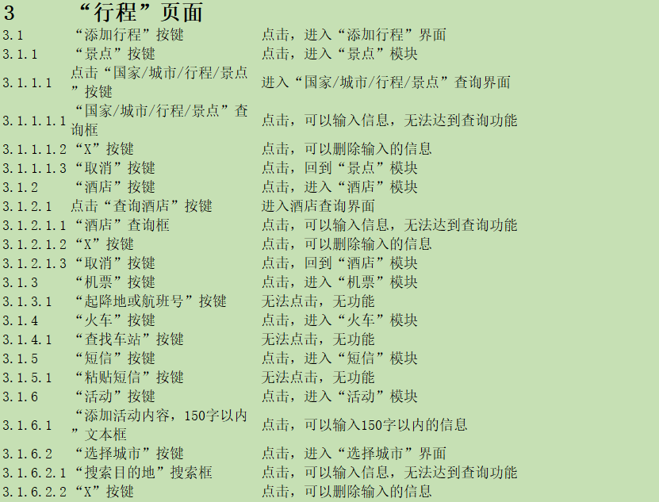
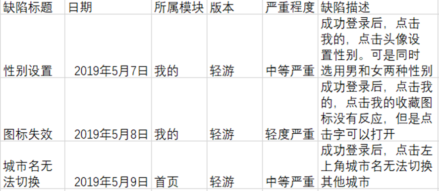

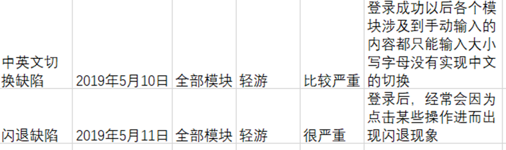

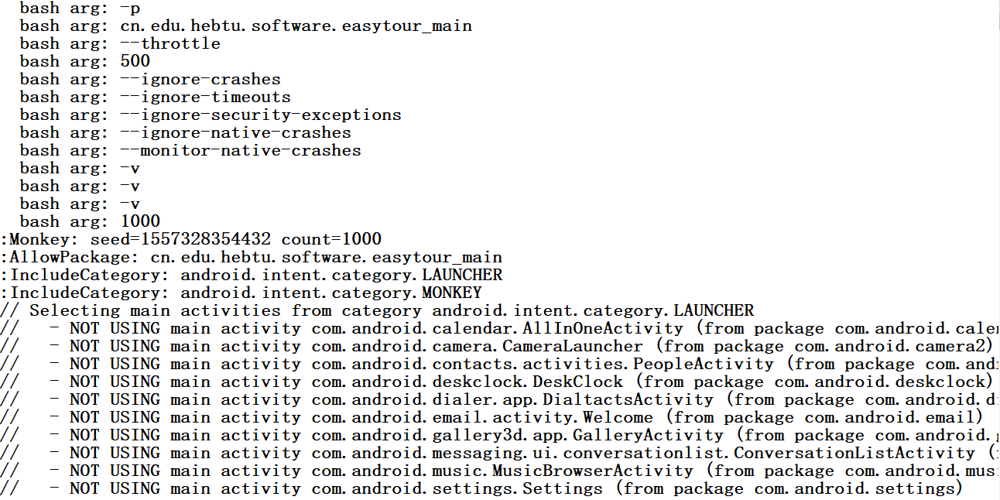
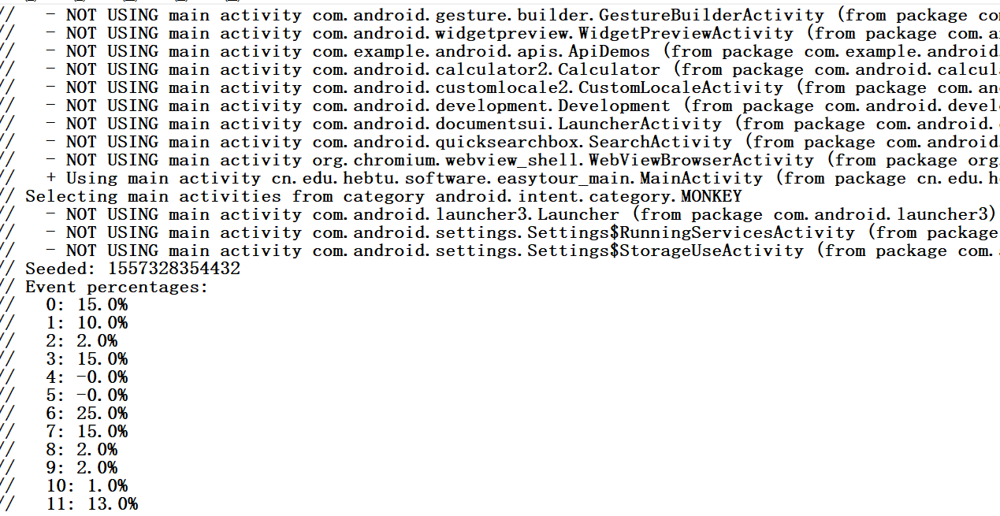

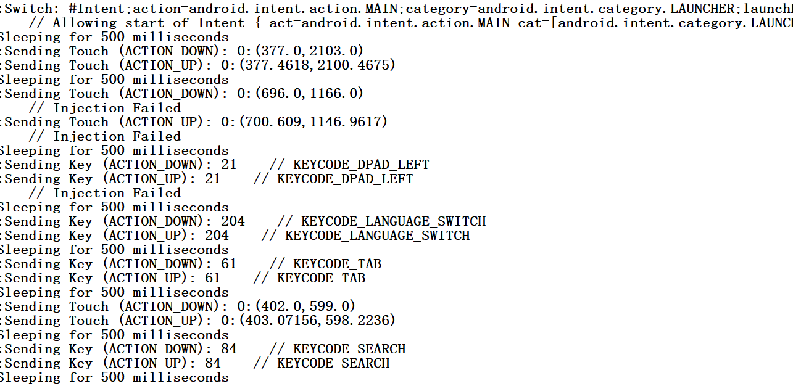
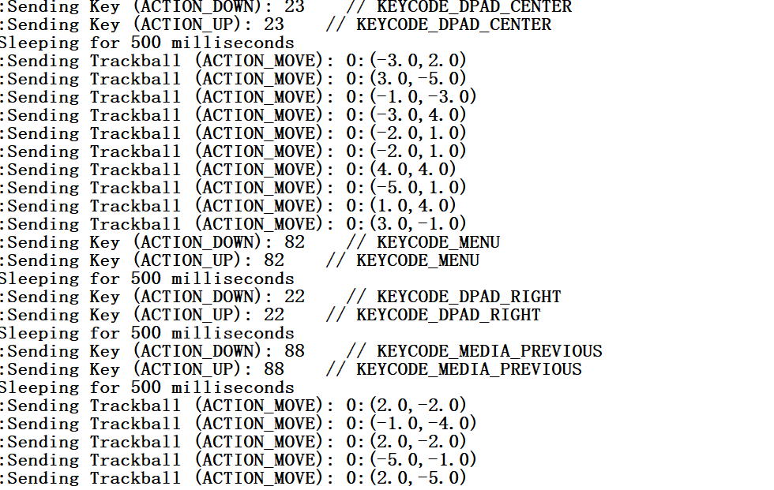

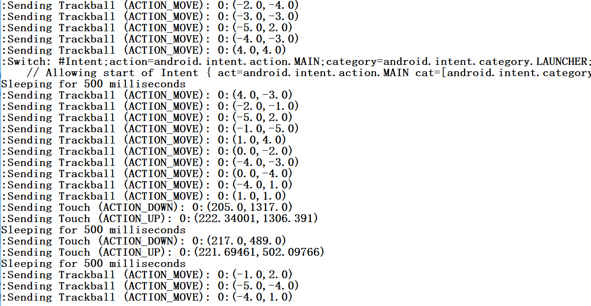
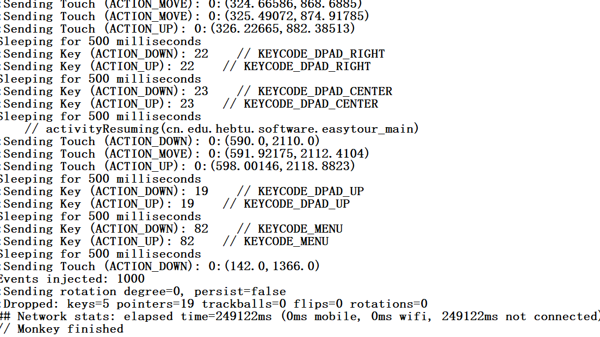

